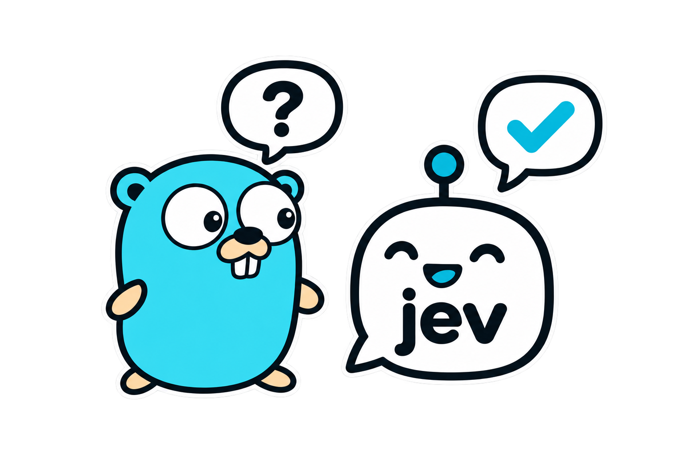

# jev



[](go.mod)
[](https://github.com/drpaneas/jev/actions/workflows/ci.yml)
[](LICENSE)

**Typed AI decisions in Go.** An unofficial [Jev](https://docs.typesafe.ai/api)
client for choosing values, estimating probabilities, and scoring against a rubric.
Standard library only.

```sh
go get github.com/drpaneas/jev
```

## Choose a Go value

Set `TYPESAFE_API_KEY`, then run:

```go
package main

import (
	"context"
	"fmt"
	"log"
	"os"

	"github.com/drpaneas/jev"
)

type Team string

func main() {
	client, err := jev.New(os.Getenv("TYPESAFE_API_KEY"))
	if err != nil {
		log.Fatal(err)
	}

	question := jev.Choice("Which team should handle this ticket?",
		jev.Opt(Team("billing"), "Payments and invoices"),
		jev.Opt(Team("support"), "Bugs and outages"),
	)
	decision, err := client.Ask(context.Background(), "I was charged twice.", question)
	if err != nil {
		log.Fatal(err)
	}

	team, ok := decision.Resolve(0.90) // team has type Team
	if !ok {
		fmt.Println("Needs human review")
		return
	}
	fmt.Println(team)
}
```

## Three question types

| Question | Result | Meaning |
| --- | --- | --- |
| `Choice` | `Decision[T]` | Choose one of your typed values |
| `Noul` | `Probability` | Estimate P(yes) |
| `Score` | `Rating` | Probability-weighted position on your rubric |

Constructors build reusable questions locally. `Ask` calls Jev; `Resolve` applies
your confidence threshold locally. Choose thresholds using your own evaluation data.

Requests have a **30-second total timeout** and **up to two retries**. Attempts may
be billed; use `jev.WithMaxRetries(0)` to disable retries.

[Batching, configuration & errors](docs/guide.md) ·
[Complete example](examples/triage/main.go) ·
[Offline example](example_test.go) ·
[MIT license](LICENSE)

Logo adapts the [Go Gopher by Renee French](https://go.dev/blog/gopher), licensed [CC BY 4.0](https://creativecommons.org/licenses/by/4.0/).
